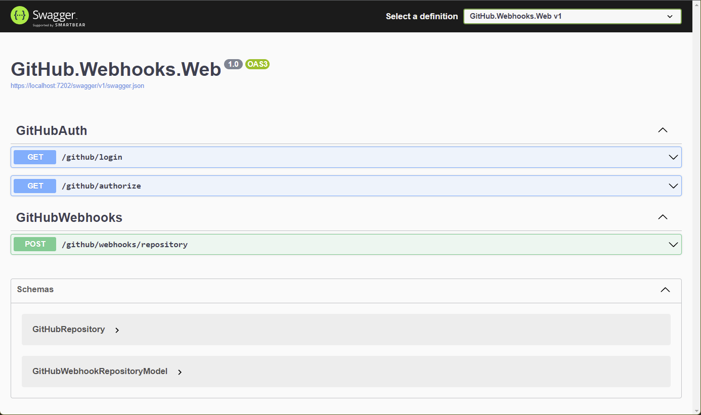

# GitHub Webhooks Challenge

## Summary

The project is a simple Web service that listens to a GitHub Organization `repository` events, and creates basic protection rules for the default (main) branch.
After the protection rules have been applied, a new *Issue* is created, mentioning the *User* that created the rules, as well as a brief summary of the protections applied.

## Running the project

The project is written in **C#**, using **ASP Core**, running on the **.NET 6** platform.

> Note: This project connects to the GitHub API using the .NET client, [Octokit.net](https://github.com/octokit/octokit.net), and the credentials are generated using the **OAuth flow**. This choice was made to have a better control over the user tokens, and to remove any potential information leak. In a real scenario, where the Web Service needs to be constantly connected to the GitHub API (self-refreshing tokens) without any user interaction, a `basic authentication` approach makes more sense, and the GitHub Client will be initialized using a `username` and `password`.

### Setup:
- install [.NET 6](https://dotnet.microsoft.com/en-us/download/dotnet/6.0) from the official website
- install [Visual Studio](https://visualstudio.microsoft.com/) from the official website
- clone the Repository, and open the `GitHub.Webhooks.sln` solution in Visual Studio
- *because we use OAuth to authenticate against the GitHub API* - create a OAuth application in your GitHub account [following the Octokit.net docs](https://github.com/octokit/octokit.net/blob/main/docs/oauth-flow.md). Use the `https://localhost:[port]/github/authorize` redirect URI.
- replace the `ClientId` and `ClientSecret` values in the `GitHub.Webhooks.Web/appsettings.json` file

### Authorizing the GitHub Client: 
- `Build` and `Run` the project in Visual Studio
- a Swagger API page should be displayed, with 3 endpoints visible



- navigate to the `https://localhost:[port]/github/login` page in your browser, and a GitHub authorization page should show up. Grant the required permissions.
- after the Grant was given, the GitHub Client has been authorized. (*Note: the Authorization step is required every time you run the project*)
- your project is now ready to receive GitHub Webhooks!

### Receiving Repository events from GitHub:
- if you don't already have a GitHub Organization, create one ([follow official docs](https://docs.github.com/en/organizations/collaborating-with-groups-in-organizations/creating-a-new-organization-from-scratch))
- in your Organization Settings, go to the `Webhooks` page and create a new Webhook ([follow official docs](https://docs.github.com/en/developers/webhooks-and-events/webhooks/creating-webhooks))
- the new Webhook should only contain the `repository` events, the rest we don't need for the scope of this project
- in the Webhook URL, set the `https://[example.com]/github/webhooks/repository` (*Note: the Webhooks cannot be configured to send events to `localhost`, but I recommend using a tool like [NGROK](https://ngrok.com/) to route Internet requests to localhost for testing purposes*)

Creating a new Repository in the Organization, should send a Webhook event to the Web Service, which should then create protection rules for the default branch, as well as a new Issue with the summary of the protection applied.

## Project Structure

### Web Service

The `GitHub.Webhooks.Web` project is a ASP WebAPI project, using the .NET 6 platform.
It contains two Controllers: `GitHubAuthController` and `GitHubWebhooksController`.

### GitHubAuthController

The `GitHubAuthController` contains the GitHub Client authorization endpoints. 

The `GET /github/login` endpoint will initiate the OAuth flow, with required user permissions (reading `user` profile, and access to the `repo` scope).

The `GET /github/authorize` endpoint is used as an Authorized Redirect URL, when GitHub will be sending the Authorization Code back to the Web Service (part of the OAuth flow. [More on the OAuth flow here](https://docs.github.com/en/developers/apps/building-oauth-apps/authorizing-oauth-apps)).

### GitHubWebhooksController

The `GitHubWebhooksController` contains the Webhook callbacks for handling GitHub webhook events.

The `POST /github/webhooks/repository` endpoint will accept *Repository* change events, and will kick off the branch protection logic.

### GitHub Client

The `GitHub.Webhooks.Client` project is a class library containing some business logic classes, and a small Octokit.net wrapper.

#### Business Logic

The `GitHubClientProvider` is a Singleton instance, which is used to initialize the GitHub client, and handle the authorization details of that Client instance. It is the primary way of getting a hold of an Authorized GitHub client. This class will receive application settings containing the `ClientId` and `ClientSecret` values, required for the OAuth flow.

The `GitHubBranchProtectionService` is a business logic Singleton instance, providing the main functionality of the project: protecting the Repository's main branch, and creating a summary of the protection using a *GitHub Issue*. It has a dependency on the `GitHubClientProvider` and will use the Authorized Client to communicate with the GitHub API.

#### Object Builders

The [Builder design pattern](https://en.wikipedia.org/wiki/Builder_pattern) is a useful design pattern to allow flexible creation of Object State, allowing easy extension without modification (enabler of the [Open-Closed Principle](https://en.wikipedia.org/wiki/Open%E2%80%93closed_principle)).

The `BranchProtectionBuilder` encapsulates the logic of building a GitHub *update branch protection request*, and allows the user of the Builder to only enable the desired features. The default usage of the Builder is done in the `GitHubBranchProtectionService`, and it does the following:

``` C#
BranchProtectionSettingsUpdate request = new BranchProtectionBuilder()
    .WithEnforceAdmins(true)
    .WithCodeOwnersRequiredReviews(true)
    .WithDismissStaleReviews(true)
    .WithRequiredReviewerCount(2)
    .Create();
```

As one can see, the Builder design pattern, allows exposing a clear API for building the desired state, easy to understand, maintain and extend.

The `NewIssueBuilder` also follows the Builder design pattern to allow creating a GitHub *Issue* object with the desired state. Compared to the previous implementation of the `BranchProtectionBuilder`, the `NewIssueBuilder` also exposes a `static` method, exposing a `Factory` way of creating an Builder. 

The [Factory Method](https://en.wikipedia.org/wiki/Factory_method_pattern) is another useful design pattern which allows creating of desired Object state from a previous state, without having to configure every aspect of the new state.

The `Factory` implementation allows using the previously created `BranchProtectionBuilder`, to serialize it's own internal state, and use that state as the `body` property for our new *Issue* object.

``` C#
public static NewIssueBuilder FromBranchProtection(BranchProtectionBuilder builder)
{
    string body = builder.ToString();
    return new NewIssueBuilder().WithBody(body);
}
```

The newly created `NewIssueBuilder` instance can then be used to extend the *Issue* state.

``` C#
NewIssue issue = NewIssueBuilder.FromBranchProtection(branchProtectionBuilder)
    .WithTitle("Branch Protection Summary")
    .Create();
```

Adopting design patterns like `Object Builder` and `Factory Method` can improve the code, while creating a nice experience for Developers.